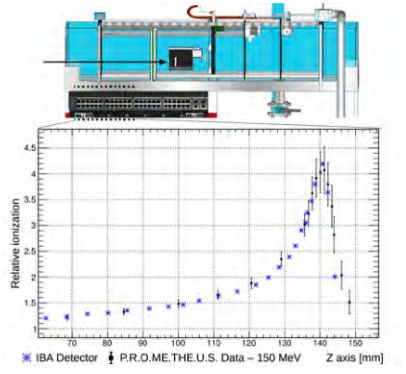
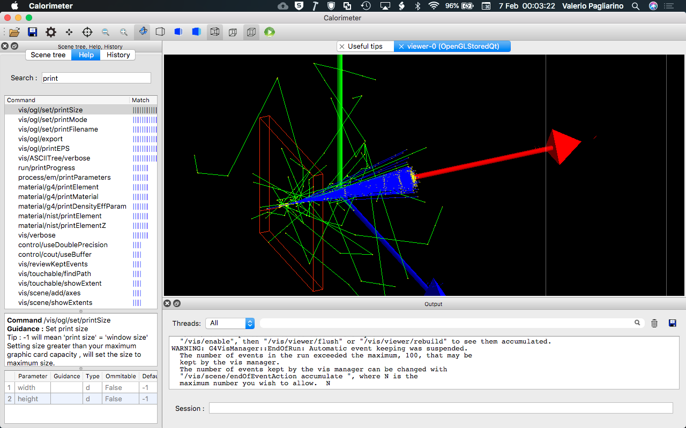
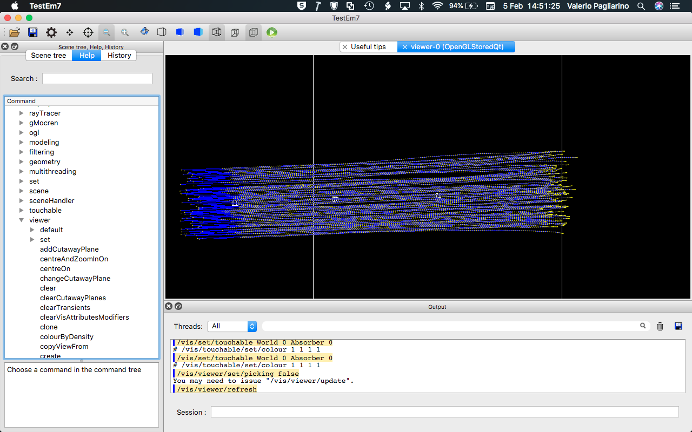
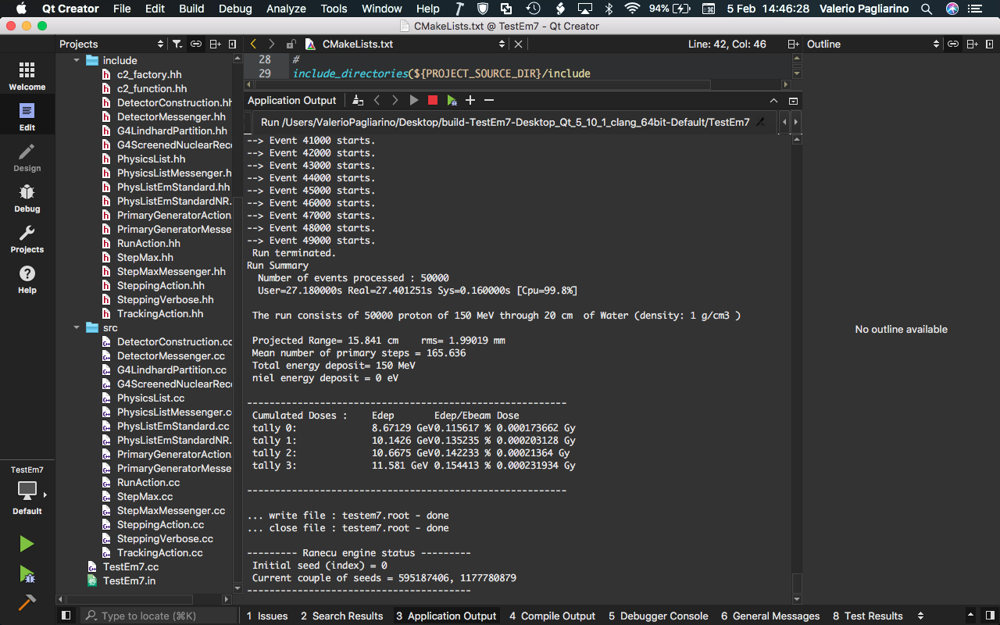
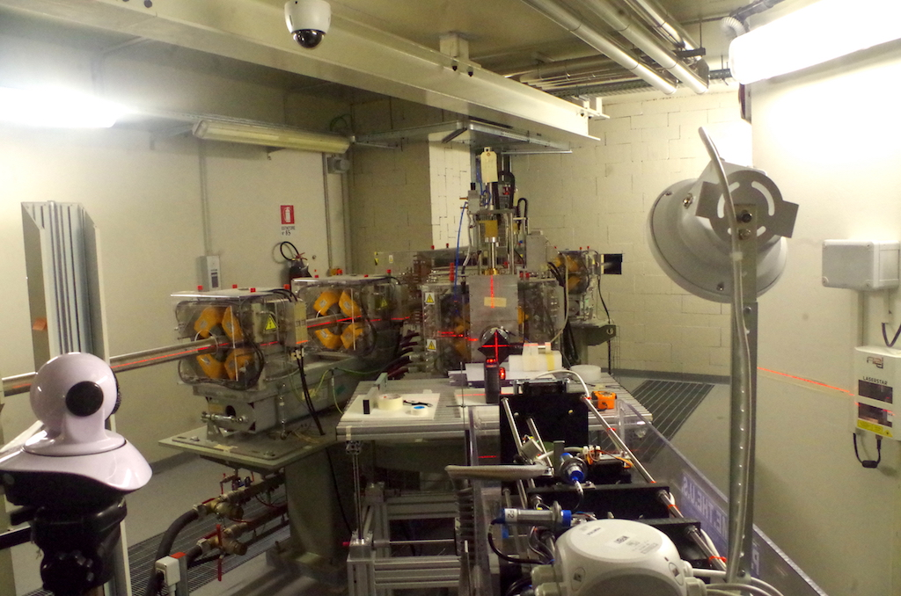
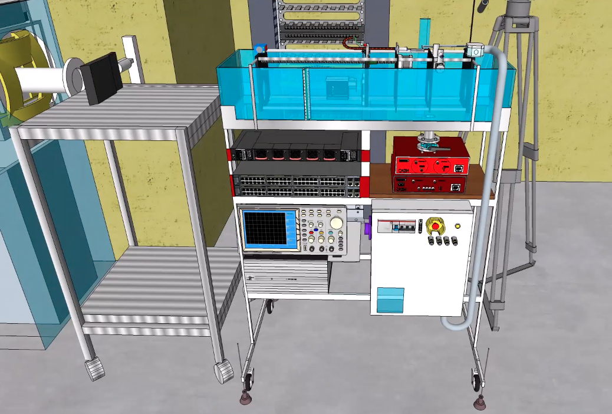
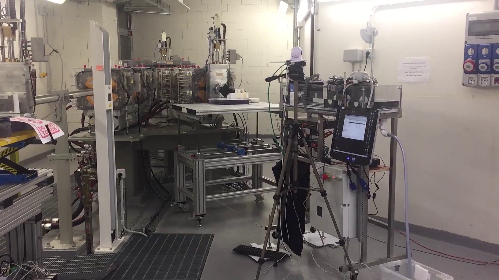

# Object Oriented Data Analysis

<b>Authors:</b>
- Francesco Calisto francesco.calisto@edu.unito.it
- Valerio Pagliarino valerio.pagliarino@edu.unito.it
- Lorenzo Cane lorenzo.cane985@edu.unito.it

### Compile instructions
After entering the code path enter, create makefile with `qmake` then compile with `make`

### Project description
This is an object-oriented software, implemented in C++, for data analysis and simulation of a sampling calorimeter based on scintillator + SiPM.

### Software features

- Data extraction
- Data labelling, pre-processing and fitting
- Energy loss reconstruction
- Numerical and Monte Carlo simulation of energy-loss experiments
- Comparison and data export

### Software architecture

- Overview of the design patterns
- Class diagram
- User diagram

### Implementation and optmization

- Implementation and optimization details

### Physics of the experiment
Please see: https://www.tifpa.infn.it/wp-content/uploads/2020/07/ActRep2018-web.pdf (page 135) 

This detector aims to measure with a spatial accuracy of $\pm$ 0.2 mm the energy loss profile of a charged ion beam, with particular focus on the Bragg peak. This measurement has important applications in nuclear physics, medical physics (protontherapy), ion implantation, radioprotection. Usually this kind of measurement is done using ionization chambers, while this sampling calorimeter is based on a $CaF_2$ scintillator read by a SiPM. The moving head that host the scintillator has a modular design that allow to install a scintillator matrix for 3D beam imaging.

<b> Example of measured energy loss profile with a 150M MeV proton beam </b>

  
  
### Simulation engine based on Geant4
  
 

  
  

  
  

  

### Test beam
This detector has been tested in 2017 thanks to the Beamline for School initiative on the proton beam facility of TIFPA, with the support of INFN, CAEN, University of Insubria.

<b> The experimental beamline of the IBA Proteus 235 MeV cyclotron at the TIFPA INFN facility. </b>

  

<b> 3D drawing of the scintillator sampling calorimeter. </b>

  

<b> The scintillator calorimeter aligned on the beamline </b>

  
  
  

  In the picture an IBA Proteus cyclotron similar to the one installed in Trento.

  

