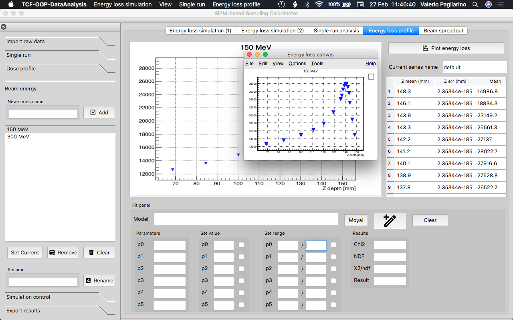
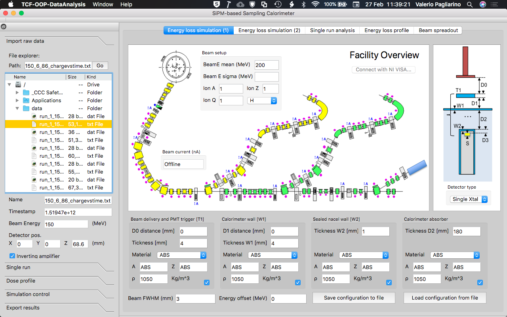
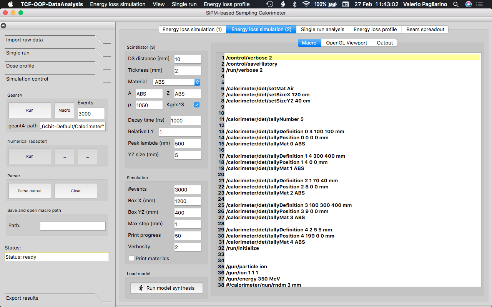

# DOCS: Calorimeter-Monte-Carlo - Tecniche di Calcolo per la Fisica (1/4)
Dip. di Fisica - Università di Torino

  

### Authors:
Valerio Pagliarino, Francesco Calisto, Lorenzo Cane

[Repository home page](https://github.com/valeriopagliarino/Tecniche-di-calcolo-2021-UNITO)

### 1. Description
Calorimeter-Monte-Carlo is a C++ application with the goal of simplyfing simulation and data analysis of a SiPM-based calorimeter experiment in particle physics.  
This application includes a frontend that is able to generate macros for the <b>Geant4</b> Monte Carlo simulation and an embedded online data analysis module based on the CERN ROOT framework. 

This software has been designed and implemented for the 6 CFU course "<b>Tecniche di Calcolo per la Fisica</b>" (Computing techniques for physics) - Physics dept. - University of Turin. 

  

## Index:

1. [Description](#description)
2. [Features](#features)
3. [Use case diagram](#ucdiagram)
4. [Architecture and design patterns](#arch)
5. [Class diagram](#classdiagram)
6. [Class description](#classdescr)
7. [Class reference](#classref)
8. [Build and deployment information](#deploy)
9. [Further development](#furtherdev)
  
### 2. Features

The experiment this application addresses [(here some pictures)](https://github.com/valeriopagliarino/Tecniche-di-calcolo-2021-UNITO/blob/main/TCF-OOP-DataAnalysis/README.md) is a sampling calorimeter designed for measuring the energy loss curve of different ions in a liquid active material (bragg peak) using calcium fluoride scintillators coupled with a SiPM matrix. (Energy range 50-300 MeV for protons.) The detector is installed in a sealed moving nacel that can move inside the active material on three axis. A simplified version of this decector has been tested in the "P.R.O.ME.THE.U.S." project at the TIFPA facility of INFN. [(Paper)](https://www.tifpa.infn.it/wp-content/uploads/2020/07/ActRep2018-web.pdf). <b> This  software provides a frontend for simulating the particle tracks and energy loss in the detector and some tools for online data analysis. In detail:

- Detector model designer

</b>

  

This interface allow to generate a model of the calorimeter by describing the position, size and material of each layer of matter that interact with the particle beam. The material catalog can be expanded defining a new `G4Material` in the `Calorimeter` Geant4 backend and adding the respective interfacing class in the frontend.
<b>

- Macro editor
</b>

  

The macro editor is automatically filled with the macro text generated during the model synthesis starting from the data entered in the designer fields. The macro editor allows advanced modifications not foreseen by the designer interface. The macro can obviously imported or exported to file.
<b>

- Simulation viewport
</b>

  

The second tab of the simulation control interface contains a canvas where the simulation 3D model, togheter with the particle tracks, is drawn. When the simulation is completed the `Geant4` backend export the vector geometry to a `.prim` file that is then rendered to a 2D `.eps` vector graphics by the `DAWN` tool (<i>Drawer for Academic WritiNgs</i>). At this point the frontend start a `system()` call to an external `ImageMagick` process that flatten the `.eps` vector to a raster `.png` image. This image is now opened in the viewport. The calls to time-intensive external processes are non-blocking.
<b>

- Energy loss profile
</b>

  

This section of this software allow online data analysis of data acquired with the calorimeter. The  <b> Single run </b> tab shows the controls for importing and fitting single run files. Each file contains events taken at a fixed position and fixed energy. Each events is a floating point  number corresponding to the average of 64 trigger events. Each trigger event is the numeric integral of the digitized pulse coming form the SiPM. The integral is performed in-firmware in the FPGA of the digitizer.
The mean value (and its uncertainty), associated with the X, Y, Z position of the detector is used to reconstruct the energy loss curve (Bragg peak) for given X and Y, if Z is the beam axis. The energy loss profile can be fitted with dedicated tools.
<b>

- Transverse beam slice
</b>

  

Using the scintillator data, acquired as explained above, at given Z or using a scan of a radiation-sensible film it is possible to recostruct the averaged dose delivery per particle on a transversal beam slice. The 2D gaussian-like profile can be fitted using proper tools in the interface.

[Next page](./useCaseDiagram.md)

